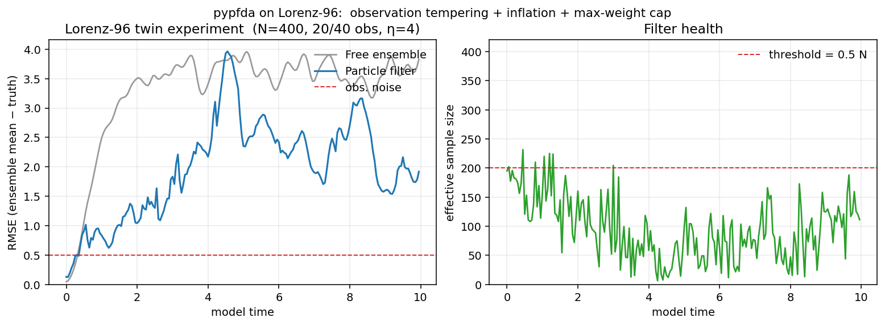

# pypfda

**Particle filter data assimilation in pure Python**, with first-class
support for paleoclimate Observing System Simulation Experiments (OSSEs).

[](https://github.com/bijanf/pypfda/actions/workflows/ci.yml)
[](https://bijanf.github.io/pypfda)
[](https://github.com/bijanf/pypfda/actions/workflows/lint.yml)
[](https://codecov.io/gh/bijanf/pypfda)
[](https://pypi.org/project/pypfda/)
[](https://pypi.org/project/pypfda/)
[](LICENSE)
[](https://github.com/astral-sh/ruff)
[](https://mypy-lang.org/)
[](https://github.com/pre-commit/pre-commit)
[](#status)

> **Status — work in progress.**
> `pypfda` is the open-source companion to a paper currently under
> review at *npj Climate and Atmospheric Science*
> ([Fallah et al., 2026](#citing-pypfda)). The core particle filter,
> weight / ESS / resampling primitives, observation tempering,
> post-resample inflation, max-weight degeneracy cap and Gaspari–Cohn
> localization are in place and tested; higher-level diagnostics
> (genealogy tracking, Welch / Nyquist spectral tools) and the paleo
> forward-model subpackage are on the roadmap. Public APIs may evolve
> before `v1.0`. Pin a specific version in production code.

`pypfda` provides a clean, model-agnostic implementation of the sequential
importance resampling (SIR) particle filter, plus the building blocks needed
to deploy it on real Earth-system problems: spatial localization, ensemble
inflation, degeneracy prevention, multi-year assimilation windows, and
ensemble diagnostics (effective sample size, weight entropy, genealogy,
spectral analysis).

The core filter knows nothing about climate models. You bring a forward
model — a Lorenz-96 toy, a coupled GCM, anything callable — and `pypfda`
runs the analysis cycle.

## It works on Lorenz-96



A 40-variable Lorenz-96 twin experiment with 400 members, observations
on every other variable, observation-error tempering (η = 4),
post-resample Gaussian inflation, and a max-weight cap (0.3). The
particle filter drives ensemble-mean RMSE down to roughly half of the
free-ensemble RMSE and keeps the effective sample size well above the
degeneracy threshold. Reproduce with

```bash
python examples/03_lorenz96_twin.py
```

This is the same combination of techniques the companion paper applies
in an online coupled-climate-model OSSE; Lorenz-96 is the smallest
chaotic benchmark on which those techniques can be exhibited end-to-end
without a climate model in the loop.

## Highlights

- **Pure Python.** No Fortran, no compilation. Works on Linux, macOS, and
  Windows.
- **Model-agnostic.** The filter is decoupled from any specific simulator;
  bring your own forward step.
- **Numerically careful.** Log-domain weight computation, well-tested
  resampling routines (systematic, stratified, residual, multinomial),
  numerically stable ESS.
- **Diagnostics.** ESS, weight entropy, genealogical diversity, rank
  histograms, spectral / Nyquist analysis for cycle-length design.
- **Paleoclimate-ready.** Optional `paleo` extra includes coral δ¹⁸O
  proxy system models and a PAGES 2k loader.
- **Production tooling.** Strict typing (`mypy --strict`), property-based
  tests, ≥ 80 % coverage, conventional commits, semantic versioning,
  reproducible builds via `hatchling`.

## Installation

```bash
pip install pypfda                 # core only
pip install 'pypfda[io,plot]'      # + NetCDF and matplotlib helpers
pip install 'pypfda[paleo]'        # + coral PSM and PAGES 2k loader
pip install 'pypfda[all]'          # everything including dev + docs
```

`pypfda` requires Python ≥ 3.10.

## 60-second example

```python
import numpy as np
from pypfda import ParticleFilter

rng = np.random.default_rng(0)
n_members, n_obs = 100, 5

# Linear Gaussian toy: x_{t+1} = 0.95 x_t + w,   y_t = H x_t + v
def forecast(state):
    return 0.95 * state + rng.normal(0, 0.5, state.shape)

H = rng.normal(size=(n_obs, 4))
truth = rng.normal(size=4)
ensemble = rng.normal(size=(n_members, 4))

pf = ParticleFilter(ess_threshold=0.5, resampling="systematic")

for _ in range(50):
    truth = 0.95 * truth + rng.normal(0, 0.5, 4)
    ensemble = np.array([forecast(m) for m in ensemble])
    obs = H @ truth + rng.normal(0, 0.1, n_obs)
    obs_pred = ensemble @ H.T
    ensemble, info = pf.assimilate(ensemble, obs_pred, obs, obs_err=0.1)
    print(f"ESS={info.ess:.1f}  resampled={info.resampled}")
```

See the [quickstart](https://bijanf.github.io/pypfda/quickstart.html) and
[Lorenz-63 tutorial](https://bijanf.github.io/pypfda/tutorials/01_lorenz63.html)
for full walk-throughs.

## Documentation

- **Theory** — derivation of the SIR update, comparison of resampling
  schemes, the diversity/memory trade-off, choosing inflation and
  localization parameters.
- **Tutorials** — Lorenz-63 twin experiment and, for high-dimensional
  chaos, the Lorenz-96 demo used by the figure above.
- **API reference** — every public function and class, generated by
  Sphinx + autosummary.

Read the docs at <https://bijanf.github.io/pypfda>.

## Citing pypfda

If you use `pypfda` in published work, please cite the software (via the
`CITATION.cff` button on GitHub) **and** the methodological paper:

> Fallah, B., et al. (2026). Bidirectional AMOC–SST coupling on fast and
> slow timescales: Causal discovery and particle filter perspectives for
> paleoclimate reconstruction. *npj Climate and Atmospheric Science*, in
> review.

A BibTeX snippet is provided in [CITATION.cff](CITATION.cff).

## Paper data

The companion paper is an Observing System Simulation Experiment built
on the coupled CM2Mc-BLING climate model with 100-member ensembles
integrated for ~100 years each (several months of cluster wall time per
experiment, of order one terabyte of netCDF output). That raw ensemble
is **not** distributed with this repository and would be impractical
to re-generate from scratch. It currently resides on the Potsdam
Institute for Climate Impact Research (PIK) cluster; interested
researchers are welcome to contact the authors for access or for
processed diagnostics.

What *is* in this repository is the **method**: a model-agnostic
implementation of the techniques the paper applies (SIR, observation
tempering, post-resample inflation, max-weight cap, Gaspari–Cohn
localization), validated on Lorenz-96 (see the figure above). That is
what the paper's Code Availability statement points to.

Scripts that operate on small processed diagnostics — for example the
Welch / Nyquist spectral analysis of the control AMOC time series —
may be added under `reproduce/` in a later release, driven by a small
Zenodo deposit. Regeneration of the full figure set is **not** a goal
of this package.

## Related work

- [`DA_offline_PF`](https://github.com/dalaiden/DA_offline_PF) — the
  Fortran offline particle filter from Dalaiden et al. that motivated
  this Python implementation.
- Dubinkina, S. et al. (2011), *Testing a particle filter to reconstruct
  climate changes over the past centuries*, IJBC 21, 3611.
- Goosse, H. et al. (2010), *Reconstructing surface temperature changes
  over the past 600 years using climate model simulations with data
  assimilation*, JGR 115.

## Contributing

Bug reports, feature requests, and pull requests are welcome. Please
read [CONTRIBUTING.md](CONTRIBUTING.md) and the [Code of
Conduct](CODE_OF_CONDUCT.md) before opening an issue or PR.

## License

`pypfda` is distributed under the [MIT License](LICENSE).
