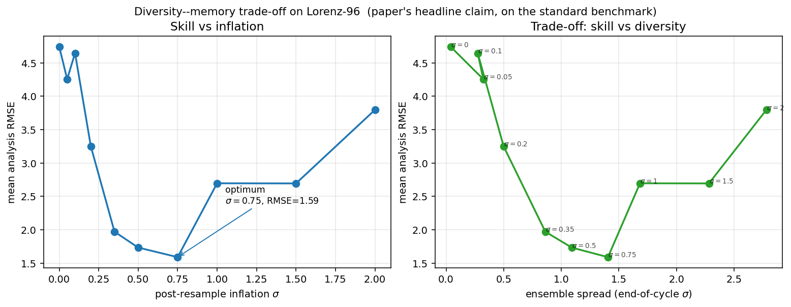
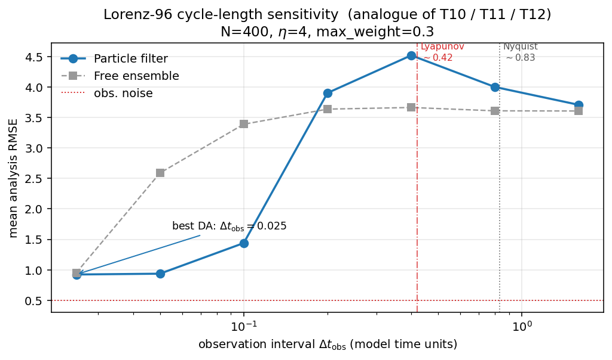
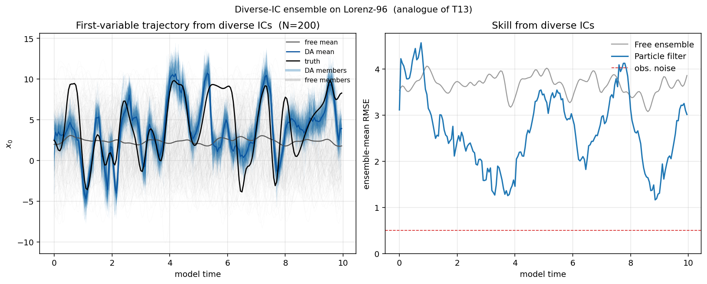
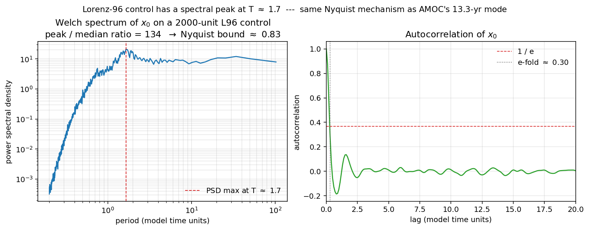

# Tutorial: paper claims reproduced on Lorenz-96

The companion paper
([Fallah et al., 2026](https://github.com/bijanf/pypfda#citing-pypfda),
in review at *npj Climate and Atmospheric Science*) makes four
methodological claims about online particle filtering that are easy
to lose track of because they emerge from an expensive coupled-model
OSSE. This tutorial re-expresses each one on the standard Lorenz-96
benchmark so that the mechanism is visible in a few minutes of
laptop time, and so the reader can verify that the filter's
qualitative behaviour is **not** an artefact of the specific model.

Each section names the paper claim, shows the corresponding figure,
explains what it means, and points at the script that regenerated it.

:::{admonition} Honest caveat
:class: important

Lorenz-96 is not AMOC. These figures are analogues, not reproductions
of the paper's figures. The mechanisms (U-curve under inflation,
Lyapunov and Nyquist bounds, convergence from diverse ICs) are shared,
but the numerical values differ and one of the four claims (cycle-
length U-curve) reverses order on Lorenz-96 because Lyapunov bites
before Nyquist. The scripts' docstrings and the captions below spell
this out explicitly.
:::

---

## 1. Diversity–memory trade-off — the headline claim

The paper's central finding is that post-resampling inflation sits
on a trade-off: without it, the resampled ensemble is all duplicates
and the filter collapses; with too much of it, the inflation noise
erases the very memory the filter has accumulated from past
observations. The result is a U-shaped skill curve with a narrow
optimum.

On Lorenz-96, running the same recipe (η = 4 observation-error
tempering, max-weight cap 0.3, N = 400 members, observation interval
0.05) and sweeping the post-resampling Gaussian inflation σ from 0
to 2 yields exactly this U-curve. Zero inflation gives RMSE ≈ 4.7
(genealogical collapse); the optimum at σ ≈ 0.75 gives RMSE ≈ 1.6;
σ = 2 gives RMSE ≈ 3.8 (noise-dominated).

The right panel is the same sweep re-parameterised as skill vs
achieved diversity: the filter must maintain *some* ensemble spread
to work, but excess spread costs skill.

Script: `examples/05_l96_diversity_memory.py`.

---

## 2. Cycle-length sensitivity — analogue of T10 / T11 / T12

The paper reports an observation-interval U-curve on AMOC (T10 = 1 yr
marginal, T11 = 5 yr best, T12 = 10 yr degraded by aliasing of the
13.3-year spectral peak). The mechanism is two intrinsic bounds:

* the **Lyapunov time** — how fast deterministic uncertainty grows
  between corrections;
* the **Nyquist bound** — half the period of the dominant oscillation.

An observation interval larger than the *tighter* of these two bounds
breaks the filter.

On Lorenz-96 (F = 8) the Lyapunov time is ~0.42 and the Nyquist bound
(from the spectral peak in section 4) is ~0.83. Both are marked on the
figure. The Lyapunov bound bites first: the filter degrades sharply
at observation intervals approaching 0.4, well inside the Nyquist-
safe window.

This is the **opposite ordering** from AMOC, where the coupled
ocean-atmosphere Lyapunov time is decades and Nyquist (driven by the
13.3-year oscillation) is the tighter bound. The paper's T11 optimum
appears *because* Lyapunov is weak and Nyquist is strong. Same
mechanism, different ordering.

Script: `examples/04_l96_cycle_sensitivity.py`.

---

## 3. Diverse initial conditions — analogue of T13

The paper's T13 ensemble starts each member from a different 50-year
slice of a 5000-year control run, spanning AMOC strengths from 17 to
26 Sv. The question it answers is whether the particle filter needs
members to share initial-state memory, or whether it can recruit a
widely-dispersed ensemble toward the truth using observations alone.
T13 shows the latter: with no shared IC, DA achieves strong positive
correlation with the truth that the free ensemble cannot.

On Lorenz-96 we spin up each of 200 members from an independent
random initial condition, so the initial ensemble is scattered across
the attractor. Left: the first state variable over time. The DA
ensemble mean (blue) tracks the chaotic truth (black); the free
ensemble mean (grey) is pinned near climatology because averaging
uncorrelated attractor trajectories returns the attractor mean.
Right: RMSE over time. DA pulls the scattered ensemble onto the
truth trajectory within a few Lyapunov times.

Script: `examples/06_l96_diverse_ics.py`.

---

## 4. Welch spectrum and the Nyquist argument

Section 4 of the paper computes a Welch spectrum of a 1500-year
control integration of the CM2Mc-BLING AMOC time series, identifies
a dominant oscillation at ~13.3 years, and uses half of that period
(~6.7 years) as a Nyquist bound on the maximum useful assimilation
cycle.

The same analysis on a 2000-unit Lorenz-96 control (F = 8, sampling
every 0.1 model time units) finds a genuine spectral peak at T ≈ 1.65
with peak / median power ratio ≈ 134. By construction the Nyquist
bound is T / 2 ≈ 0.83 — the same grey dotted line overlaid on the
cycle-sensitivity figure above.

The autocorrelation panel is an independent sanity check. The e-fold
time is 0.30 — tight, consistent with the Lyapunov-limited
predictability horizon. The ACF then oscillates with period ≈ 1.65,
matching the spectrum.

So Lorenz-96 carries the same Nyquist mechanism the paper invokes for
AMOC; the difference is which of the two intrinsic bounds is
binding in which regime.

Script: `examples/07_l96_nyquist.py`.

---

## What this tutorial is for

* For **paper reviewers** — a laptop-runnable demonstration that the
  algorithmic contributions of the paper are implementable outside
  POEM / CM2Mc-BLING and that they produce the expected filter
  behaviour on a standard benchmark.
* For **future users of `pypfda`** — a gallery of canonical
  experimental setups, each <200 lines, that can be adapted to a
  different forward model by replacing the `integrate()` call.
* For **ourselves** — an always-on regression check. If a future
  refactor of the core `ParticleFilter` class breaks the
  diversity-memory U-curve or the cycle-sensitivity shape, it shows
  up immediately in the rebuilt figures.
